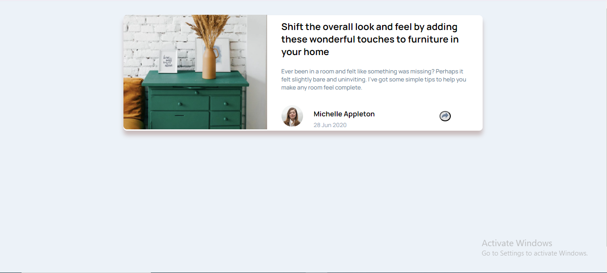
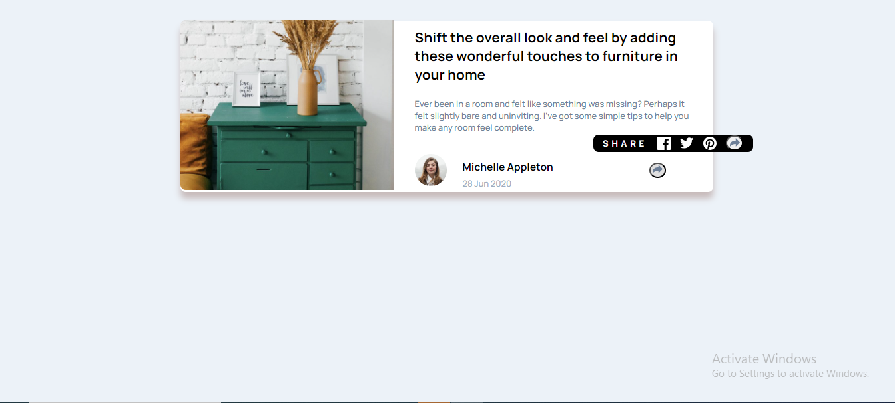
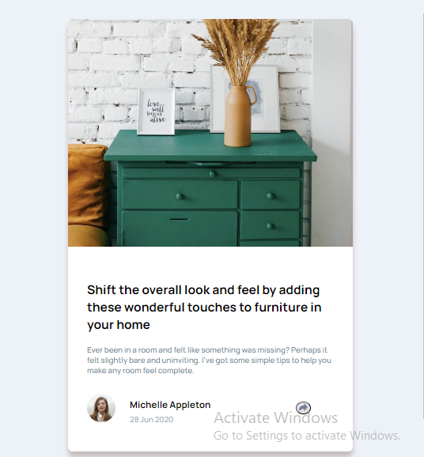
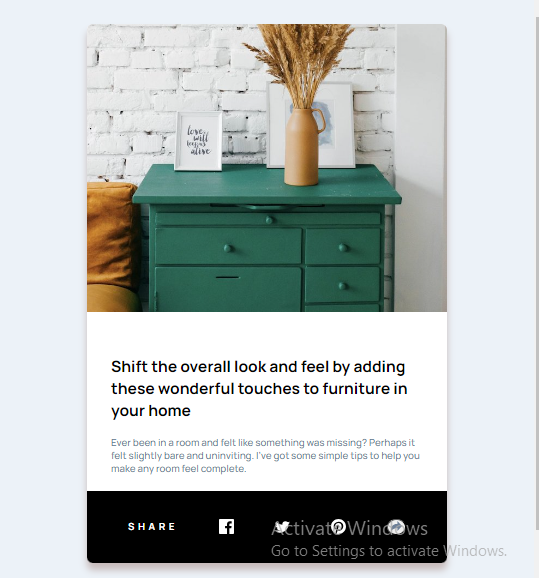

# Frontend Mentor - Article preview component solution

This is a solution to the [Article preview component challenge on Frontend Mentor](https://www.frontendmentor.io/challenges/article-preview-component-dYBN_pYFT).

## Table of contents

- [Overview](#overview)
  - [The challenge](#the-challenge)
  - [Screenshot](#screenshot)
  - [Links](#links)
- [My process](#my-process)
  - [Built with](#built-with)
  - [What I learned](#what-i-learned)
  - [Continued development](#continued-development)
- [Author](#author)

## Overview

### The challenge

Users should be able to:

- View the optimal layout for the component depending on their device's screen size
- See the social media share links when they click the share icon

### Screenshot

### Links

- Solution URL: [Git Hub Repo Link ](https://github.com/KrishnaPoddar1/ArtcilePreviewComponent.git)
- Live Site URL: [Live site URL ](https://krishnapoddar1.github.io/ArtcilePreviewComponent/)

## My process

### Built with

- Semantic HTML5 markup
- CSS custom properties
- Flexbox
- Mobile-first workflow
- Javascript
- Visual Studio Code

### What I learned

This was the first time I utilized Javascript in my project so it was new learning curve. I had to also deal with new desgin for a same element which will be hidden and integrated with the javascript for the first time.

### Continued development

Would love to work on projects that will imporve my overall Front end skills.

## Author

- Frontend Mentor - [@KrishnaPoddar1](https://www.frontendmentor.io/profile/KrishnaPoddar1)
